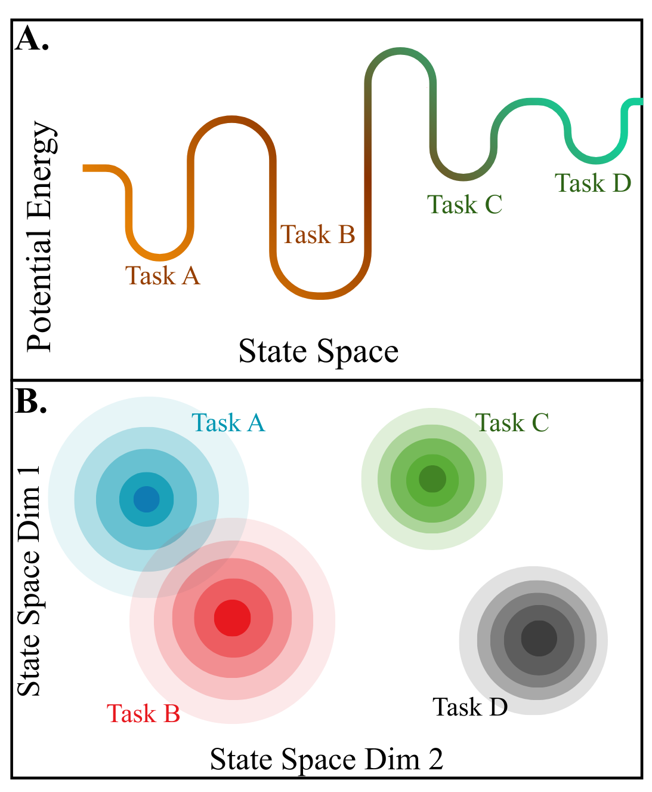

\maketitle

\begin{flushleft}
\textbf{Ulrich Mayr}\\
Department of Psychology, University of Oregon\\
mayr@uoregon.edu
\vspace{0.5cm}

\textbf{Sophia Angleton}\\
Department of Psychology, University of Oregon\\
sopa@uoregon.edu

\textbf{Dominik Graetz}\\
Department of Psychology, University of Oregon\\
dgrtz@uoregon.edu

\textbf{Neha Nagarkar}\\
Department of Psychology, University of Oregon\\
nagarkar@uoregon.edu
\end{flushleft}


```{r}
#| include: false
library(tidyverse)
library(janitor)
library(readr)
library(rio)
library(psych) 
library(stats)
library(lmerTest)
library(sjPlot)
library(hausekeep)
library(hlmer)

#import dataset
AlternateRuns <- read_csv("AlternateRuns.csv")
#view(AlternateRuns) 

norm_for_errorbars <- function(dv,ID){
  dat <- tibble(dv = dv,ID=ID)
  dat2 <- dat %>%
    mutate(grand_mean = mean(dv,na.rm=T)) %>%
    group_by(ID) %>%
    mutate(submean = mean(dv,na.rm=T)) %>%
    ungroup() %>%
    mutate(normdv = dv - submean + grand_mean)
  return(dat2$normdv)
}

my_theme <- theme_minimal(base_size =10) +
  theme(
    text = element_text(family = "Times New Roman"),
    plot.background = element_rect(fill = "white", color = NA),
    panel.background = element_rect(fill = "white", color = NA),
    panel.grid.major = element_blank(),
    panel.grid.minor = element_blank(),
    axis.line = element_line(color = "black"),
    axis.title = element_text(size = 12),
    axis.text = element_text(size = 10),
    legend.title = element_text(size = 10),
    legend.text = element_text(size = 9),
    plot.title = element_text(size = 15, face = "bold")
  )

theme_set(my_theme)

knitr::opts_chunk$set( warning = FALSE, message = FALSE, fig.width = 5.5, fig.height = 4, fig.align = "center")


normWS <- function(d ,s, dv, between = NULL) { #within subject normalization
  eval(substitute(d %>%
                    dplyr::group_by(s) %>%
                    dplyr::mutate(sAV = mean(dv, na.rm = TRUE)) %>%
                    dplyr::group_by_at(between) %>% #this is grouping by between subjects variables
                    dplyr::mutate(gAV = mean(dv, na.rm = TRUE)) %>%
                    dplyr::mutate(DV_n = dv - sAV + gAV), list(s = as.name(s), dv = as.name(dv))))
}


get_ci <- function(var, mean){
  sd <- sd(var, na.rm = TRUE)
  n <- length(var)
  se <- sd/sqrt(n)
  ci <- abs(qt(0.025, n-1, lower.tail = FALSE))*se
  return(c(mean + ci, mean - ci, sd, se, n))
}

convert_extremes <- function(value){
  
  if(value == 1){
    
    value = value - 1e-5
    
  } else if (value == 0 ){
    
    value = value + 1e-5
    
  }
  
  return(value)
  
}#making sure error is either .99 or .001

```

```{r}
#| include: false 
#rename columns to understand better
alt_run <- AlternateRuns %>% 
  rename(dimshape = dim1, dimcolor = dim2, rt = time) %>% #remane variables 
  filter(block != 0) #filter practice trials out

alt_run <- alt_run %>% group_by(id, block, trial) %>% #remove sub 57 showing up 3 times
slice(1)

#determine 80% acc

#crit # need at least 179 out of 896 trials to be correct, denoted by 0 in error col
sum_er <- alt_run %>% 
  group_by(id) %>% 
summarize(acc = mean(1-error), 
          N = n())
sum_er

sum_er <- sum_er %>% 
  filter(acc < .8) 

alt_run <- alt_run %>% 
  filter(!id %in% sum_er$id) #removing those outliers here 

#Making new variables
alt_run <- alt_run %>% 
 # arrange(id, trial) %>% 
  group_by(id, block) %>%
  mutate(
    switch = if_else(cycle %in% c(1,5), 1, 0),
    cycle2 = ifelse(cycle > 4, cycle - 4, cycle),
    group = ifelse(cycle2 == 1, 1, 0),
    group = cumsum(group),
    lerror = lag(error, 1), 
    ltrial = lag(trial, 1), 
    lrt = lag(rt, 1),
    valence = if_else(dimshape == 4 | dimcolor == 4, 1, 2),  # 1 = uni, 2 = bi
    lvalence = lag(valence, 1), 
    conflict = if_else(dimshape != dimcolor & dimshape !=4 & dimcolor != 4, 1,0), 
    lconflict = lag(conflict), 
  ) %>%
  group_by(id, block, group) %>%
  mutate(lvalence = lvalence[1]) %>%                         # constant within 4‑trial group
  ungroup() %>% 
  mutate(
    cycle_helmert = cycle2
  )


alt_run <- alt_run %>% #making contrasts outlined in prereg
  group_by(id, block, group) %>% 
  mutate(
    lvalence_contr = case_when(lvalence == 1 ~ -0.5, lvalence == 2 ~ 0.5),
    valence_contr = case_when(valence == 1 ~ -0.5, valence == 2 ~ 0.5)
    )


#compute z-score on trial level 
alt_run <- alt_run %>% 
  group_by(id, cycle2, valence, lvalence) %>% #cycle or cycle2
  mutate(
    z = (rt - mean(rt[error == 0 & lerror == 0])) / sd(rt[error == 0 & lerror == 0])) %>% 
  ungroup()

# # Overall count 
# overall_outliers <- alt_run %>% summarize(n_outliers = sum(abs(z) > 3, na.rm = TRUE)) #overall_outliers
# 
# # Per participant 
# outliers_by_id <- alt_run %>% 
#   group_by(id) %>%
#   summarize(n_outliers = sum(abs(z) > 3, na.rm = TRUE))
# #outliers_by_id
# 


#last filtering then adding a continuous trials variable
alt_run <- alt_run %>%
           filter(group != 1) %>% 
mutate(rt_log = (log(rt)), 
       filter_correct = ifelse(error == 1 | lerror == 1, 1, 0)
       )
alt_run <- alt_run %>% 
  mutate( valence= factor(valence), 
    lvalence = factor(lvalence),
    cycle2 = factor(cycle2),
    id = factor(id),
  switch = factor(switch)) %>% 
      group_by(id) %>% 
  mutate(conttrials = 1:n())

#Remove z‑score outliers
alt_run <- alt_run %>%
  filter(abs(z) <= 3 | is.na(z)) 

#for the within-sub analysis
#create a new variable in initial data with trial numbers that continue adding person 
#new model to take the residuals from, this needs to include block trial and sub, need to add poly function within the model (doing just conttrials instead)
set.seed(123)
polymodel <- lmer(
  rt_log ~ poly(conttrials, 2)* (poly(conttrials, 2) | id), control = lmerControl(optimizer = 'bobyqa'),#poly(x,2) is specifications for linear and quadratic
  data = alt_run %>% filter(error == 0)#filers out cur er 
)
#summary(polymodel)

#looking for 1 is linear 2 is quadratic
#residuals for this new model 

#tab_model(polymodel, show.est = T, auto.label = F, show.stat = T, df.method = 'satterthwaite')

#create a new column in the dataframe using residuals() 
alt_run$logresidual <- NA
alt_run$logresidual[alt_run$error == 0] <- residuals(polymodel)

alt_run <- alt_run %>%
  group_by(id, block) %>%
  mutate(lrt_logres = lag(logresidual, 1),
         lrt_log = lag(rt_log, 1))

### Reverse Helmert Contrasts

m <- contr.helmert(4) #this is the matrix genereated that we will place onto our cycle variable

m[,1] <- rev(m[,1])

m[,2] <- rev(m[,2])
m[,3] <- rev(m[,3])
#reverse helmert
colnames(m) <- c('3vr','2vr','1vr')

alt_run <- alt_run %>% 
  mutate(cycle_helmert = cycle2
           )
contrasts(alt_run$cycle_helmert) <- m

contrasts(alt_run$cycle_helmert) 

#view(alt_run)

```


## Abstract


\newpage
## Introduction

A dominant view in research on cognitive control holds that adjustments of control are constrained by a general stability-flexibility tradeoff. Specifically, increasing the stability of a task-relevant representation makes flexible changes of that representation more difficult [@goschke_2000_intentional]. You may be planning to give a speech for example, relying on your notes helps you stay on message (high stability), but it can also make it harder to smoothly switch into an improvised, conversational mode when a question arises (reduced flexibility). The very thing that keeps you anchored can also slow you down when you need to pivot. Understanding stability and flexibility mechanisms is also of vital importance in the clinical world, with impaired regulation of cognitive control being implicated in various neurodevelopmental disorders such as attention deficit hyperactivity disorder, cerebral palsy, and autism spectrum disorder [@cepeda_2000_task; @dcruz_2013_reduced; @tajikparvinchi_2021_the]. In these cases, disruptions in cognitive control can manifest as either overly rigid behavior or excessive distractibility, underscoring the importance of understanding the mechanisms that support both maintaining and updating task-relevant representations.

A recent reevaluation of the generalizability of the stability-flexibility tradeoff has posited that this negative tradeoff relationship may occur only in highly specified contexts [@mayr_2024_does]. 

- ADD: expand on the contexts being at different levels of analysis (refer back to the review paper).

These authors pointed toward a possible anti-tradeoff pattern, implying that cognitive stability and flexibility are both driven by a common factor and therefore can co-occur 	[@mayr_2014_longterm].  

- set up proceeding paragraghs about the two views with stab/flex. highlight more that this may arise due to differences in the levels of analysis stab/flex mechanisms are studied. 

***Attractor Landscape Prediction Model.*** The prediction of a tradeoff relationship arises from connectionist models of cognitive control. The behavior of these models can be described within an “attractor landscape” [@brown_2007_a; @geddert_2022_no] illustrated in Fig. 1A. In this framework, different task representations form basins in a state space, and the depth of a basin reflects how strongly a task is currently activated. A deeper basin corresponds to a more stable task state, but it also requires more “energy” to move out of, making task switching more difficult.

One data pattern that is consistent with this tradeoff prediction arises when examining task-switch costs as a function of previous-trial conflict. High conflict on the previous trial is assumed to strengthen the currently active task representation, effectively deepening its basin. This increased stability should then make switching on the next trial harder, producing larger switch costs.  Indeed, much of the dominant narrative in cognitive control has been built around this tradeoff pattern [@goschke_2000_intentional]. Yet, there are also several recent results that call the generalizability of this finding into question [@geddert_2022_no; @brown_2007_a; @mayr_2014_longterm].

- ADD: sentence hinting at the level of analysis being a possible reason why there are conflicting results to the stab/flex pattern. this is true for both setting up tradeoff and antitradeoff. 

***Cognitive Map Prediction Model.*** Contrary to predictions from the attractor model, there are recent hints suggesting the possibility of an anti-tradeoff pattern, where flexibility and stability appear to co-occur [@mayr_2014_longterm; @morales_2022_age]. In response to these results, Mayr and Graetz have suggested replacing the attractor-landscape perspective with a cognitive map conceptualization (Fig. 1B). Here, different tasks are locations within a task space that can be represented with varying degrees of resolution. The higher the resolution, the more stable tasks are encoded, but also the easier they are to find when switching, resulting in an anti-tradeoff pattern [@mayr_2024_does]. Despite some evidence for such anti-tradeoff patterns [@morales_2022_age], this prediction has not been rigorously tested.



***The Current Study.*** We investigate where differences in the stability-flexibility dilemma arise through a multi-level approach to analysis. Previous work in cognitive control has not performed a rigorous test of experimental effects, within-subject effects, and individual differences on the same dataset. 

- ADD: fill this out more, add a sentence about how we know that results differ depending on the level of analysis you look and that it is possible that a tradeoff and an antitradeoff relationship can be found in the same task, just at different levels 

Experimental level: Here we test whether experimental manipulations of previous and current trial control demands interact with the switch contrast in a manner that is consistent with a flexibility/stability tradeoff model. 

Within-subject level: Here we test whether trial-by-trial RT auto-correlations in combination with considering the experimental effects express a flexibility/stability tradeoff.  

Individual differences level: Here we test whether individual differences in measures of “stability/efficiency” and in measures of flexibility are consistent with the tradeoff model.  


## References
